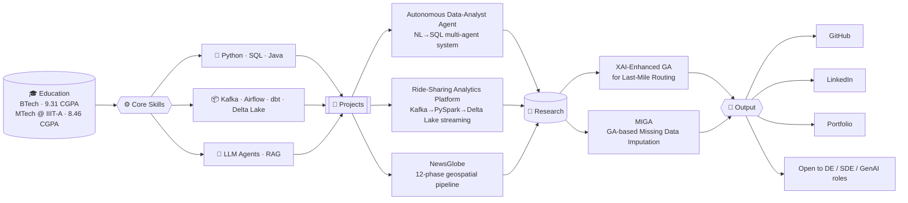

<h1 align="center">Hi, I'm Madhav Kamble 👋</h1>
<h3 align="center">Data Engineer in training · MTech @ IIIT Allahabad · GenAI & Applied Research</h3>

<br>

```java
/**
 * MTech Data Engineering, IIIT Allahabad (2025-27)
 * Placement Coordinator, Batch 2025
 */
public class MadhavKamble implements DataEngineer, ResearchAssistant {

    private final String location   = "Prayagraj, India";
    private final String[] focus    = {"Data Engineering", "GenAI/Agentic AI", "SDE"};
    private final String thesis     = "XAI-driven Genetic Algorithms for Last-Mile Routing (VRP)";
    private final String currently  = "Placement prep — DSA, System Design, Core CS";

    @Override
    public Pipeline build(String source) {
        return new Pipeline(source, "production");
    }

    @Override
    public String toString() {
        return "Turning messy data into reliable pipelines, one commit at a time.";
    }
}
```

<br>

## 🏗️ System Architecture



<br>

## 🔬 Research

**XAI-Enhanced Genetic Algorithm for Last-Mile Routing** *(MTech Thesis)*
An audit and extension of a published GA-based approach for last-mile delivery routing (Kim, Khir & Lee, IEEE TEVC). Found a normalization bug in the released code that inflated the reported baseline, showed the paper's SHAP-based weighting scheme was redundant against a simpler closed-form decomposition weight, and identified zone-order error as the dominant error source over intra-zone error. A memetic 2-opt refinement beat the original paper's result, and a follow-up exact-DP substitution pushed performance below 3rd place on the Amazon LMRRC leaderboard.

**MIGA — Genetic-Algorithm-Based Missing Data Imputation**
First open-source Python implementation of MIGA (Figueroa-García et al., *Information Sciences*, 2023). Benchmarked against MICE, KNN, and mean imputation across 7 UCI datasets with Wilcoxon significance testing. Extended the original method with Ledoit-Wolf shrinkage covariance, adaptive mutation scheduling, MNAR evaluation, and a kurtosis-augmented fitness function — surfacing an Fr→RMSE orthogonality result along the way. Ongoing research at IIIT Allahabad.

<br>

## 🚀 Featured Projects

| Project | Description | Stack |
|---|---|---|
| **[Autonomous Data-Analyst Agent](https://github.com/MadhavKamble/autonomous-data-analyst-agent)** | Multi-agent system (Planner → RAG → SQL Generator → Executor → Critic → Summarizer) converting NL questions into verified SQL, with a bounded self-correction loop and 67 passing pytest tests. [Live demo →](https://autonomous-data-analyst-agent-adaa.vercel.app/) | FastAPI, React, PostgreSQL, Groq (Llama 3.3 70B), RAG, pgvector |
| **[Real-Time Ride-Sharing Analytics Platform](https://github.com/MadhavKamble/realtime-rideshare-pipeline)** | End-to-end streaming platform simulating Uber/Ola internals — Kafka ingestion through PySpark Structured Streaming into a Delta Lake medallion (Bronze→Silver→Gold) architecture, with an ML-powered surge pricing model and a live dashboard. Redis caching cut dashboard read latency from ~10s to <1ms; 4 production Airflow DAGs orchestrate refresh, retraining, data quality, and cache warmup across 10 Docker services | Python, Kafka, PySpark, Delta Lake, Airflow, XGBoost, MLflow, Redis, Streamlit, Docker |
| **NewsGlobe** | 12-phase geospatial data pipeline with orchestration and testing at scale | dbt, Airflow, PostGIS, 102 pytest + 22 dbt tests |

<br>

## 🧰 Core Skills

**Languages**
<p align="left">
  
  
  
  
  
  
  
  
  
</p>

**Frameworks**
<p align="left">
  
  
  
  
  
  
</p>

**Databases**
<p align="left">
  
  
  
</p>

**Data Engineering**
<p align="left">
  
  
  
  
  
  
</p>

**GenAI & ML Engineering**
<p align="left">
  
  
  
  
  
  
  
</p>

**Research & Optimization**
<p align="left">
  
  
  
  
</p>

**Data & ML**
<p align="left">
  
  
  
  
  
  
</p>

**Tools**
<p align="left">
  
  
  
  
  
  
</p>

**Relevant Coursework:** Big Data Analytics · Data Visualisation · Machine Learning · Operating Systems · Computer Networks · DBMS

<br>

## 🏆 Achievements

- LeetCode Rating: **1669**
- CodeChef Rating: **1441**
- Runner-Up — Sinhgad Hackathon 2k23
- Runner-Up — Sinhgad Hackathon 2k22

<br>

## 📜 Certifications & Licenses

- **0 to 100 Full-Stack Cohort** — 100xDevs (2024)
- **Cyber Threat Intelligence 101** — arcX (2024)
- **Getting Started with Enterprise Data Science** — IBM (2024)

<br>

## 🐍 Contribution Snake

<p align="center">
  <picture>
    <source media="(prefers-color-scheme: dark)" srcset="https://raw.githubusercontent.com/MadhavKamble/MadhavKamble/output/github-contribution-grid-snake-dark.svg" />
    <source media="(prefers-color-scheme: light)" srcset="https://raw.githubusercontent.com/MadhavKamble/MadhavKamble/output/github-contribution-grid-snake.svg" />
    
  </picture>
</p>

<br>

## 📊 GitHub Stats

<p align="left">
  
  
</p>

<br>

## 🎲 Beyond the Code

```bash
$ whoami
madhav — mostly caffeine and constant integration, occasionally sleep

$ cat /etc/interests
🏎️  F1 — will debate strategy calls at 1am
🏏  Cricket — silent during a chase, unbearable after
🤖  Serial Claude consumer — if it can be asked, I've asked it
🥦  Vegetarian — don't ask about the mess food

$ ./run_forever.sh
[perpetually] compiling code, watching qualifying, arguing with an LLM until it agrees with me
```

<br>

## 📫 Connect

<p align="left">
  <a href="https://www.linkedin.com/in/madhav-kamble-64710a221/"></a>
  <a href="https://github.com/MadhavKamble"></a>
  <a href="https://madhav-kamble.vercel.app/"></a>
  <a href="mailto:madhavukamble@gmail.com"></a>
</p>

<br>

<p align="center"><i>compiled with 0 errors, 12 existential crises.</i></p>
